# Multi-Tenant Marketing Intelligence Dashboard
## Technical Implementation Plan & Proposal

---

> **Prepared for:** Client RFP — Multi-Tenant SaaS Dashboard  
> **Version:** 1.0  
> **Date:** September 2026  
> **Classification:** Confidential — Client Proposal  

---

## Table of Contents

1. [Executive Summary](#1-executive-summary)
2. [Solution Architecture Overview](#2-solution-architecture-overview)
3. [Technology Stack & Justification](#3-technology-stack--justification)
4. [Multi-Tenancy Strategy](#4-multi-tenancy-strategy)
5. [Database Design](#5-database-design)
6. [Authentication & Authorization](#6-authentication--authorization)
7. [Data Pipeline Architecture](#7-data-pipeline-architecture)
8. [API Design](#8-api-design)
9. [Frontend & Dashboard Architecture](#9-frontend--dashboard-architecture)
10. [Natural-Language Insights Layer](#10-natural-language-insights-layer)
11. [Security Architecture](#11-security-architecture)
12. [Scalability & Performance](#12-scalability--performance)
13. [Observability & Monitoring](#13-observability--monitoring)
14. [Testing Strategy](#14-testing-strategy)
15. [CI/CD & Deployment](#15-cicd--deployment)
16. [Phased Delivery Plan](#16-phased-delivery-plan)
17. [Risk Assessment & Mitigation](#17-risk-assessment--mitigation)
18. [Cost Estimation](#18-cost-estimation)
19. [Post-Launch & Maintenance](#19-post-launch--maintenance)
20. [Phase 2 Roadmap](#20-phase-2-roadmap)
21. [Assumptions & Clarification Points](#21-assumptions--clarification-points)
22. [Answers to Proposal Questions](#22-answers-to-proposal-questions)

---

## 1. Executive Summary

We propose to build a **unified marketing intelligence platform** — a multi-tenant SaaS dashboard that consolidates marketing data from Meta, Instagram, LinkedIn, and Google Analytics 4 into a single, intuitive interface. The platform eliminates the pain of manually collecting and reconciling reports across fragmented marketing tools, giving marketing teams a single source of truth with historical depth and — in Phase 2 — AI-driven actionable insights.

### Value Proposition

| Value | Description |
|-------|-------------|
| **Unified Visibility** | Single pane of glass across Meta, Instagram, LinkedIn, and GA4 — no more tab-switching or CSV exports |
| **Historical Durability** | A real stored data layer. Metrics persisted beyond platform API retention limits, enabling true YoY comparisons |
| **Automated Sync** | Configurable scheduling (1–24hr) with auto token refresh. Zero manual intervention under normal operation |
| **Enterprise Multi-Tenancy** | Database-level tenant isolation (PostgreSQL RLS) from day one — not bolted on later |
| **AI-Ready Architecture** | Natural language query engine designed into the data model, deployable after core dashboard stabilizes |
| **Persona-Driven UX** | Purpose-built views for Marketing Managers, CMOs, Business Owners, and Agencies with multi-client support |

### Delivery Approach

We execute across **six sequenced phases over 16 weeks**, following the client's stated priority order:

```
Foundation → Integrations → Pipeline → Dashboard → Reliability → AI Insights
 (W1-3)       (W4-6)         (W7-8)     (W9-11)     (W12-13)      (W14-16)
```

Each phase produces a deployable increment with defined acceptance criteria. Multi-tenancy and security are foundational — they are built first, not hardened later.

### Key Architectural Decisions

- **PostgreSQL with Row-Level Security** for tenant isolation at the database kernel level
- **NestJS (Node.js/TypeScript)** backend for structured, type-safe API development
- **Next.js 14** frontend with SSR for performance and SEO-ready dashboards
- **BullMQ + Redis** for reliable job scheduling and async data pipeline processing
- **AWS (ECS Fargate, RDS, ElastiCache)** for managed, scalable infrastructure
- **LangChain + GPT-4o** for the natural-language insights layer with Text-to-SQL

---

## 2. Solution Architecture Overview

### Design Principles

| Principle | Implementation |
|-----------|---------------|
| **Data-at-rest, not live-pull** | Dashboard reads from stored PostgreSQL data, never calls platform APIs on page load |
| **Tenant isolation as infrastructure** | RLS policies enforce isolation at the database level, independent of application logic correctness |
| **Connector abstraction** | Each platform integration implements a common interface; adding a new platform is a single module |
| **Horizontal scalability** | API servers and pipeline workers scale independently based on load vs. queue depth |
| **Graceful degradation** | Token expiry, API outages, and rate limits are handled with retry, backoff, and clear user-facing status |

### High-Level Architecture

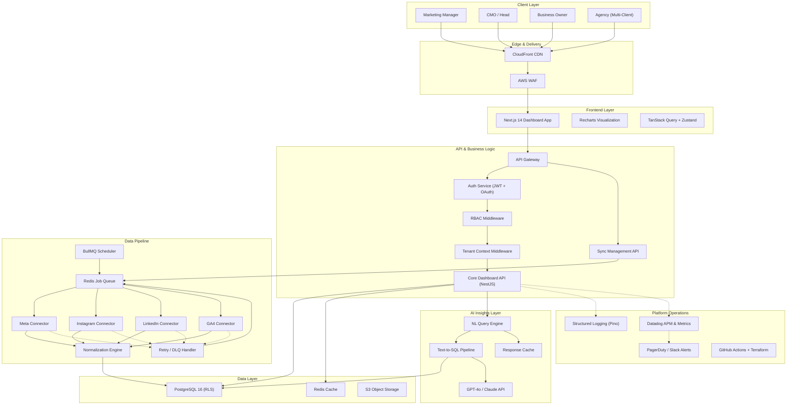

### Data Flow Patterns

**Pattern 1 — Dashboard Read Path:**
```
User → CDN → Next.js SSR → API Gateway → Tenant Middleware → Core API → Redis Cache (hit?) → PostgreSQL → Response
```

**Pattern 2 — Data Ingestion Path:**
```
Scheduler → Redis Queue → Worker picks job → Check token → Refresh if needed → Call Platform API → Validate response → Normalize → Upsert to PostgreSQL → Update sync_logs → Emit metric
```

**Pattern 3 — AI Query Path:**
```
User query → NL Engine → Inject tenant context + schema → LLM generates SQL → Validate SQL (SELECT only, tenant-scoped) → Execute against read replica → LLM synthesizes natural language response → Cache → Return
```

---

## 3. Technology Stack & Justification

| Layer | Technology | Why This Choice for This Project |
|-------|-----------|----------------------------------|
| **Backend Framework** | **NestJS 5 (Node.js 22, TypeScript)** | Structured module system with built-in DI, guards, interceptors, and decorators. The module-per-feature pattern maps cleanly to this project's domains (auth, connectors, metrics, sync). First-class TypeScript eliminates an entire class of bugs. Built-in scheduling (`@nestjs/schedule`) and queue (`@nestjs/bullmq`) support reduces integration overhead. |
| **Primary Database** | **PostgreSQL 16** | Native Row-Level Security (RLS) — the single most important capability for this project. RLS enforces tenant isolation at the database engine level, meaning even application bugs cannot leak cross-tenant data. JSONB support handles semi-structured platform-specific API responses. Mature partitioning for time-series metrics data. |
| **ORM / Query Builder** | **Prisma 6** | Type-safe query builder with auto-generated TypeScript types from schema. Schema-first migrations align with this project's need for strict, auditable schema evolution. Raw SQL escape hatch for complex analytics queries. |
| **Cache & Queue** | **Redis 7 (via ElastiCache)** | Dual purpose: (1) BullMQ job queue for reliable async pipeline processing with retries, backoff, and dead letter queues, and (2) API response caching to serve dashboard reads from memory when data hasn't changed since last sync. |
| **Frontend Framework** | **Next.js 14 (App Router, React 18)** | SSR for initial dashboard load performance (critical for large datasets). API routes for lightweight BFF pattern. React ecosystem provides the richest charting/visualization library options. Vercel-compatible but self-hostable on AWS. |
| **Charting** | **Recharts + Tremor** | Recharts for custom data visualizations (line, bar, area, pie). Tremor for pre-built dashboard components (KPI cards, sparklines, metric badges). Both are React-native with excellent TypeScript support. |
| **Styling** | **Tailwind CSS 4 + shadcn/ui** | Utility-first CSS for rapid, consistent UI development. shadcn/ui provides accessible, unstyled component primitives that match the "simple, professional" product principle. |
| **Infrastructure** | **AWS (ECS Fargate, RDS, ElastiCache, S3, CloudFront)** | Managed services reduce operational burden. Fargate eliminates server management. RDS provides automated backups, point-in-time recovery, and read replicas. ElastiCache for managed Redis. CloudFront for global edge caching. Well-established pricing model for per-tenant cost estimation. |
| **IaC** | **Terraform** | Declarative infrastructure management. Environment parity (dev/staging/prod) from identical configuration. State locking prevents concurrent drift. |
| **CI/CD** | **GitHub Actions** | Native GitHub integration. Matrix builds for parallel test execution. Environment-based deployment approvals. Reusable workflow definitions. |
| **AI/LLM** | **LangChain.js + OpenAI GPT-4o** | LangChain provides structured prompt templating, chain composition, and output parsing. GPT-4o balances reasoning capability (critical for SQL generation) with cost and latency. Swappable — Claude or Gemini can substitute if cost or capability needs shift. |
| **Observability** | **Datadog (APM, Logs, Metrics)** | Unified platform for traces, metrics, and logs. Pre-built integrations for NestJS, PostgreSQL, Redis. Custom dashboards for sync pipeline health. Alerting with PagerDuty/Slack integration. |
| **Error Tracking** | **Sentry** | Real-time error aggregation with source maps. Release tracking correlates errors to deployments. |

### Stack Alternatives Considered

| Alternative | Why Not |
|------------|---------|
| **Supabase** | Excellent for rapid prototyping but limits control over RLS policy complexity, migration workflows, and background job architecture. The sync pipeline's needs (complex retry logic, rate limit coordination, multi-step normalization) exceed what Supabase Edge Functions offer. Good for simpler CRUD apps, but this project needs fine-grained architectural control. |
| **Firebase** | NoSQL data model doesn't suit the highly relational nature of org→account→platform→metric→post hierarchies. Firestore security rules are less expressive than PostgreSQL RLS for complex tenant scoping. |
| **Django/Python** | Strong ORM and admin, but the async I/O patterns needed for concurrent platform API calls and real-time dashboard updates are more natural in Node.js. The team's primary expertise is TypeScript-first. |
| **Schema-per-tenant** | Operationally expensive: migrations must run against every schema, connection pooling becomes complex, and adding a tenant requires DDL. RLS achieves equivalent isolation with a single schema. |

---

## 4. Multi-Tenancy Strategy

### Approach: Shared Database, Shared Schema, Row-Level Security

We implement **database-level tenant isolation using PostgreSQL Row-Level Security (RLS)** in a shared schema. Every tenant-scoped table includes an `organization_id` column, and RLS policies enforce that queries can only access rows belonging to the authenticated tenant.

### Why RLS Over Alternatives

| Approach | Pros | Cons | Verdict |
|----------|------|------|---------|
| **Shared DB + RLS** ✅ | Single schema to migrate. Database-enforced isolation. No app-layer trust required. Scales to thousands of tenants. | Requires careful RLS policy design. Slightly more complex queries. | **Selected** — best balance of security, operational simplicity, and cost |
| **Schema-per-tenant** | Strong isolation. Easy per-tenant backup. | Migration nightmare at scale. Connection pool per schema. DDL on tenant creation. | Rejected — operational cost too high beyond ~50 tenants |
| **Database-per-tenant** | Maximum isolation. Independent scaling. | Extremely expensive. Deployment complexity. Cross-tenant analytics impossible. | Rejected — cost-prohibitive for this use case |
| **App-layer filtering only** | Simple to implement. | One missing WHERE clause = data leak. No defense in depth. | Rejected — violates the hard isolation requirement |

### RLS Implementation Detail

#### Step 1: Tenant Context Setting

Every authenticated request sets the tenant context on the database connection before executing any query:

```typescript
// NestJS Middleware — sets tenant context on every DB request
@Injectable()
export class TenantContextMiddleware implements NestMiddleware {
  constructor(private readonly prisma: PrismaService) {}

  async use(req: Request, res: Response, next: NextFunction) {
    const organizationId = req.user?.organizationId;
    if (!organizationId) {
      throw new UnauthorizedException('No tenant context');
    }

    // Set PostgreSQL session variable used by RLS policies
    await this.prisma.$executeRawUnsafe(
      `SET app.current_tenant_id = '${organizationId}'`
    );

    next();
  }
}
```

#### Step 2: RLS Policies on Every Tenant-Scoped Table

```sql
-- Enable RLS on all tenant-scoped tables
ALTER TABLE organizations ENABLE ROW LEVEL SECURITY;
ALTER TABLE users ENABLE ROW LEVEL SECURITY;
ALTER TABLE connected_accounts ENABLE ROW LEVEL SECURITY;
ALTER TABLE daily_metrics ENABLE ROW LEVEL SECURITY;
ALTER TABLE content_posts ENABLE ROW LEVEL SECURITY;
ALTER TABLE sync_logs ENABLE ROW LEVEL SECURITY;

-- Policy: Users can only see their own organization's data
CREATE POLICY tenant_isolation ON users
    FOR ALL
    USING (organization_id = current_setting('app.current_tenant_id')::uuid);

CREATE POLICY tenant_isolation ON connected_accounts
    FOR ALL
    USING (organization_id = current_setting('app.current_tenant_id')::uuid);

CREATE POLICY tenant_isolation ON daily_metrics
    FOR ALL
    USING (organization_id = current_setting('app.current_tenant_id')::uuid);

CREATE POLICY tenant_isolation ON content_posts
    FOR ALL
    USING (organization_id = current_setting('app.current_tenant_id')::uuid);

CREATE POLICY tenant_isolation ON sync_logs
    FOR ALL
    USING (organization_id = current_setting('app.current_tenant_id')::uuid);

-- Superuser bypass for migrations and background jobs
CREATE POLICY admin_bypass ON daily_metrics
    FOR ALL
    TO service_role
    USING (true);
```

#### Step 3: Application-Level Defense in Depth

Even with RLS, we add application-level guards:

```typescript
// Guard decorator for controller-level tenant validation
@Injectable()
export class TenantGuard implements CanActivate {
  canActivate(context: ExecutionContext): boolean {
    const request = context.switchToHttp().getRequest();
    const resourceOrgId = request.params.organizationId;
    const userOrgId = request.user.organizationId;

    if (resourceOrgId && resourceOrgId !== userOrgId) {
      throw new ForbiddenException('Cross-tenant access denied');
    }
    return true;
  }
}
```

#### Step 4: Tenant Isolation Testing

```typescript
describe('Tenant Isolation', () => {
  it('should prevent Tenant A from reading Tenant B data', async () => {
    // Set context to Tenant A
    await db.$executeRaw`SET app.current_tenant_id = ${tenantA.id}`;
    
    // Insert data as Tenant B (via admin bypass)
    await db.$executeRaw`SET app.current_tenant_id = ${tenantB.id}`;
    await db.dailyMetric.create({ data: tenantBMetric });

    // Switch back to Tenant A and query
    await db.$executeRaw`SET app.current_tenant_id = ${tenantA.id}`;
    const results = await db.dailyMetric.findMany();

    // Tenant A must NEVER see Tenant B's data
    expect(results.every(r => r.organizationId === tenantA.id)).toBe(true);
    expect(results.some(r => r.organizationId === tenantB.id)).toBe(false);
  });
});
```

---

## 5. Database Design

### Entity-Relationship Diagram

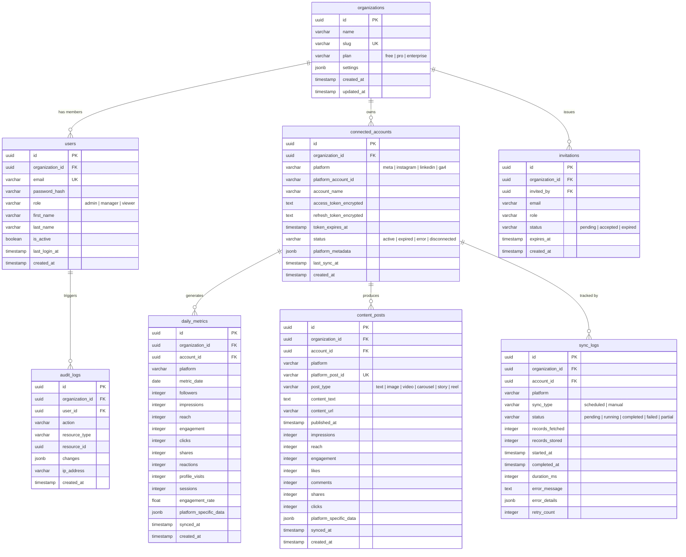

### Indexing Strategy

```sql
-- Primary access patterns: tenant-scoped queries with date ranges
CREATE INDEX idx_daily_metrics_org_date ON daily_metrics (organization_id, metric_date DESC);
CREATE INDEX idx_daily_metrics_org_account_date ON daily_metrics (organization_id, account_id, metric_date DESC);
CREATE INDEX idx_daily_metrics_org_platform_date ON daily_metrics (organization_id, platform, metric_date DESC);

-- Content post lookups
CREATE INDEX idx_content_posts_org_published ON content_posts (organization_id, published_at DESC);
CREATE INDEX idx_content_posts_org_platform ON content_posts (organization_id, platform, published_at DESC);
CREATE UNIQUE INDEX idx_content_posts_platform_id ON content_posts (platform, platform_post_id);

-- Sync status monitoring
CREATE INDEX idx_sync_logs_org_status ON sync_logs (organization_id, status, started_at DESC);
CREATE INDEX idx_sync_logs_account_status ON sync_logs (account_id, status);

-- Connected account lookups
CREATE INDEX idx_connected_accounts_org ON connected_accounts (organization_id, platform);
CREATE INDEX idx_connected_accounts_status ON connected_accounts (status) WHERE status != 'active';

-- User lookups
CREATE UNIQUE INDEX idx_users_email ON users (email);
CREATE INDEX idx_users_org ON users (organization_id);
```

### Table Partitioning (for scale)

```sql
-- Partition daily_metrics by month for efficient range queries and archival
CREATE TABLE daily_metrics (
    id UUID DEFAULT gen_random_uuid(),
    organization_id UUID NOT NULL,
    account_id UUID NOT NULL REFERENCES connected_accounts(id),
    platform VARCHAR(20) NOT NULL,
    metric_date DATE NOT NULL,
    -- ... other columns
    PRIMARY KEY (id, metric_date)
) PARTITION BY RANGE (metric_date);

-- Create monthly partitions (automated via pg_partman or scheduled DDL)
CREATE TABLE daily_metrics_2026_09 PARTITION OF daily_metrics
    FOR VALUES FROM ('2026-09-01') TO ('2026-10-01');
```

### Data Retention Policy

| Data Type | Retention | Strategy |
|-----------|-----------|----------|
| `daily_metrics` | 3 years active, archive beyond | Partition drop + S3 archival |
| `content_posts` | 2 years active | Soft delete + archive |
| `sync_logs` | 90 days detailed, 1 year summary | Aggregate then purge |
| `audit_logs` | 7 years (compliance) | Cold storage migration |

### Migration Strategy

- **Tool:** Prisma Migrate (schema-first, generates SQL migrations)
- **Process:** Migration files versioned in git. Applied as pre-deploy hook in CI/CD pipeline
- **Safety:** All migrations tested against staging DB with production-like data volume before prod deploy
- **Rollback:** Every migration has a corresponding `down` migration. Destructive changes (column drops) are two-phase: deprecate → verify no usage → remove

---

## 6. Authentication & Authorization

### Authentication Architecture

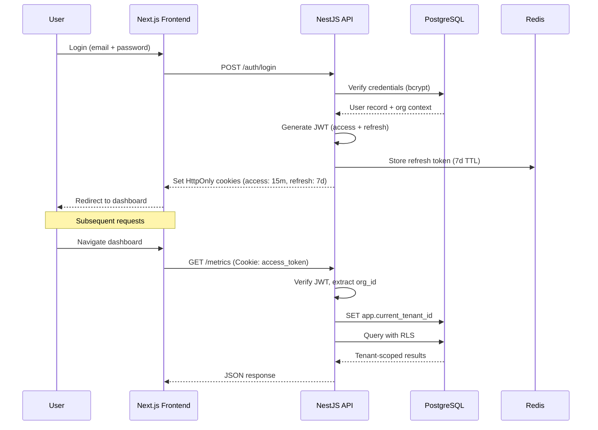

### JWT Token Design

```typescript
// Access Token Payload (15-minute expiry)
interface AccessTokenPayload {
  sub: string;           // user ID
  email: string;
  organizationId: string;
  role: 'admin' | 'manager' | 'viewer';
  iat: number;
  exp: number;           // 15 minutes
}

// Refresh Token (7-day expiry, stored in Redis)
// Rotated on each use (one-time use refresh tokens)
```

**Why HttpOnly Cookies over localStorage:**
- Immune to XSS token theft (JavaScript cannot read HttpOnly cookies)
- Automatic inclusion on same-origin requests (no manual header management)
- Refresh token rotation prevents replay attacks

### OAuth Flow for Platform Connections

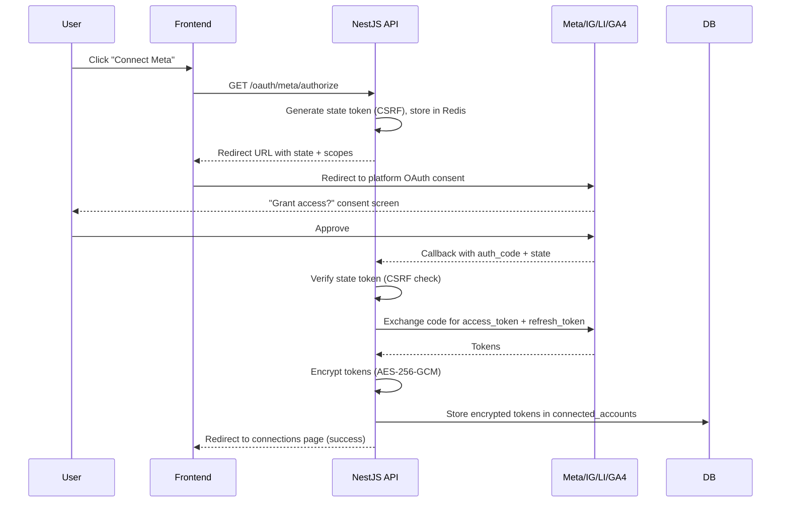

### Token Encryption

```typescript
// Token encryption using AES-256-GCM with per-token IV
import { createCipheriv, createDecipheriv, randomBytes } from 'crypto';

const ENCRYPTION_KEY = process.env.TOKEN_ENCRYPTION_KEY; // 32-byte key from secrets manager

function encryptToken(plaintext: string): string {
  const iv = randomBytes(16);
  const cipher = createCipheriv('aes-256-gcm', Buffer.from(ENCRYPTION_KEY, 'hex'), iv);
  let encrypted = cipher.update(plaintext, 'utf8', 'hex');
  encrypted += cipher.final('hex');
  const authTag = cipher.getAuthTag().toString('hex');
  return `${iv.toString('hex')}:${authTag}:${encrypted}`;
}

function decryptToken(ciphertext: string): string {
  const [ivHex, authTagHex, encrypted] = ciphertext.split(':');
  const decipher = createDecipheriv(
    'aes-256-gcm',
    Buffer.from(ENCRYPTION_KEY, 'hex'),
    Buffer.from(ivHex, 'hex')
  );
  decipher.setAuthTag(Buffer.from(authTagHex, 'hex'));
  let decrypted = decipher.update(encrypted, 'hex', 'utf8');
  decrypted += decipher.final('utf8');
  return decrypted;
}
```

### Token Refresh Lifecycle

Each platform has different token behaviors:

| Platform | Token Type | Expiry | Refresh Strategy |
|----------|-----------|--------|-----------------|
| **Meta/Facebook** | Long-lived page token | 60 days | Exchange short-lived → long-lived on connect. Refresh before expiry via `/oauth/access_token` endpoint |
| **Instagram** | Long-lived token (via Meta) | 60 days | Same as Meta (Instagram Graph API uses Meta OAuth) |
| **LinkedIn** | OAuth 2.0 refresh token | Access: 60 days, Refresh: 1 year | Standard refresh_token grant. Re-auth if refresh expires |
| **Google Analytics 4** | OAuth 2.0 refresh token | Access: 1 hour, Refresh: indefinite | Standard refresh_token grant on every sync |

```typescript
// Automatic token refresh before API calls
async function getValidToken(account: ConnectedAccount): Promise<string> {
  const token = decryptToken(account.accessTokenEncrypted);
  
  if (isTokenExpiringSoon(account.tokenExpiresAt, REFRESH_BUFFER_MINUTES)) {
    try {
      const newTokens = await refreshPlatformToken(account.platform, {
        refreshToken: decryptToken(account.refreshTokenEncrypted),
      });
      
      await db.connectedAccount.update({
        where: { id: account.id },
        data: {
          accessTokenEncrypted: encryptToken(newTokens.accessToken),
          refreshTokenEncrypted: newTokens.refreshToken 
            ? encryptToken(newTokens.refreshToken) 
            : account.refreshTokenEncrypted,
          tokenExpiresAt: newTokens.expiresAt,
          status: 'active',
        },
      });
      
      return newTokens.accessToken;
    } catch (error) {
      // Mark account as needing re-auth
      await db.connectedAccount.update({
        where: { id: account.id },
        data: { status: 'expired' },
      });
      throw new TokenExpiredError(account.platform, account.id);
    }
  }
  
  return token;
}
```

### RBAC Implementation

```typescript
// Role-based access control decorator
export const Roles = (...roles: Role[]) => SetMetadata('roles', roles);

@Injectable()
export class RolesGuard implements CanActivate {
  constructor(private reflector: Reflector) {}

  canActivate(context: ExecutionContext): boolean {
    const requiredRoles = this.reflector.getAllAndOverride<Role[]>('roles', [
      context.getHandler(),
      context.getClass(),
    ]);
    
    if (!requiredRoles) return true;
    
    const { user } = context.switchToHttp().getRequest();
    return requiredRoles.includes(user.role);
  }
}

// Usage in controllers
@Controller('connections')
export class ConnectionsController {
  @Post()
  @Roles('admin')  // Only admins can add connections
  async addConnection(@Body() dto: CreateConnectionDto) {}

  @Post(':id/sync')
  @Roles('admin', 'manager')  // Admins and managers can trigger sync
  async triggerSync(@Param('id') id: string) {}

  @Get()
  @Roles('admin', 'manager', 'viewer')  // Everyone can view
  async listConnections() {}
}
```

### Permission Matrix

| Action | Admin | Manager | Viewer |
|--------|:-----:|:-------:|:------:|
| View dashboard & metrics | ✅ | ✅ | ✅ |
| Filter/export data | ✅ | ✅ | ✅ |
| Ask AI questions | ✅ | ✅ | ✅ |
| Trigger manual sync | ✅ | ✅ | ❌ |
| View sync logs | ✅ | ✅ | ❌ |
| Connect/disconnect platforms | ✅ | ❌ | ❌ |
| Invite/remove users | ✅ | ❌ | ❌ |
| Manage organization settings | ✅ | ❌ | ❌ |
| Change user roles | ✅ | ❌ | ❌ |

---

## 7. Data Pipeline Architecture

### Connector Architecture

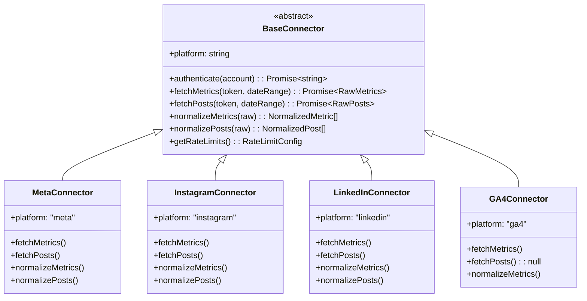

### Connector Implementation Pattern

```typescript
// Abstract base connector — all platforms implement this interface
export abstract class BaseConnector {
  abstract readonly platform: Platform;

  // Template method — defines the sync workflow
  async sync(account: ConnectedAccount, dateRange: DateRange): Promise<SyncResult> {
    const syncLog = await this.createSyncLog(account, 'running');
    
    try {
      // 1. Get valid token (refresh if needed)
      const token = await this.authenticate(account);
      
      // 2. Fetch raw data from platform API
      const rawMetrics = await this.fetchWithRetry(
        () => this.fetchMetrics(token, dateRange),
        this.getRateLimits()
      );
      
      const rawPosts = await this.fetchWithRetry(
        () => this.fetchPosts(token, dateRange),
        this.getRateLimits()
      );
      
      // 3. Normalize to standard schema
      const normalizedMetrics = this.normalizeMetrics(rawMetrics);
      const normalizedPosts = this.normalizePosts(rawPosts);
      
      // 4. Validate data quality
      this.validateMetrics(normalizedMetrics);
      
      // 5. Upsert to database
      const stored = await this.store(account, normalizedMetrics, normalizedPosts);
      
      // 6. Update sync log
      await this.completeSyncLog(syncLog.id, 'completed', stored);
      
      return { status: 'completed', recordsStored: stored };
    } catch (error) {
      await this.completeSyncLog(syncLog.id, 'failed', 0, error);
      throw error;
    }
  }

  // Retry with exponential backoff and rate limit awareness
  protected async fetchWithRetry<T>(
    fn: () => Promise<T>,
    rateLimits: RateLimitConfig,
    maxRetries = 3
  ): Promise<T> {
    for (let attempt = 0; attempt <= maxRetries; attempt++) {
      try {
        await this.respectRateLimit(rateLimits);
        return await fn();
      } catch (error) {
        if (error.status === 429) {
          const retryAfter = error.headers?.['retry-after'] || 60;
          await this.sleep(retryAfter * 1000);
          continue;
        }
        if (attempt === maxRetries) throw error;
        await this.sleep(Math.pow(2, attempt) * 1000); // Exponential backoff
      }
    }
    throw new Error('Max retries exceeded');
  }

  abstract authenticate(account: ConnectedAccount): Promise<string>;
  abstract fetchMetrics(token: string, dateRange: DateRange): Promise<RawMetrics>;
  abstract fetchPosts(token: string, dateRange: DateRange): Promise<RawPost[]>;
  abstract normalizeMetrics(raw: RawMetrics): NormalizedMetric[];
  abstract normalizePosts(raw: RawPost[]): NormalizedPost[];
  abstract getRateLimits(): RateLimitConfig;
}
```

### Platform API Details

| Platform | API | Rate Limits | Key Metrics Fetched |
|----------|-----|-------------|---------------------|
| **Meta** | Graph API v19.0 | 200 calls/user/hour | Page followers, post reach, impressions, engagement, post-level likes/comments/shares |
| **Instagram** | Instagram Graph API (via Meta) | Shared with Meta quota | Followers, reach, impressions, profile visits, post engagement, story/reel metrics |
| **LinkedIn** | Marketing API v2 | 100 calls/day per app | Organization followers, post impressions, clicks, reactions, shares, engagement rate |
| **GA4** | Google Analytics Data API v1 | 10,000 requests/day per project | Users, sessions, engagement rate, traffic sources, landing pages, device breakdown |

### Scheduler Design

```typescript
// BullMQ-based centralized scheduler
@Injectable()
export class SyncSchedulerService {
  constructor(
    @InjectQueue('sync') private syncQueue: Queue,
    private accountService: ConnectedAccountService,
  ) {}

  // Runs every hour — checks which accounts need syncing
  @Cron(CronExpression.EVERY_HOUR)
  async scheduleSyncs() {
    const accounts = await this.accountService.findAccountsDueForSync();
    
    for (const account of accounts) {
      await this.syncQueue.add(
        'sync-account',
        {
          accountId: account.id,
          organizationId: account.organizationId,
          platform: account.platform,
          syncType: 'scheduled',
        },
        {
          jobId: `sync-${account.id}-${Date.now()}`,
          attempts: 3,
          backoff: { type: 'exponential', delay: 60000 },
          removeOnComplete: { age: 86400 }, // Keep completed jobs for 24h
          removeOnFail: { age: 604800 },    // Keep failed jobs for 7d
          priority: account.platform === 'ga4' ? 1 : 2, // GA4 has lower rate limits
        }
      );
    }
  }

  // Manual sync trigger (Admin/Manager only)
  async triggerManualSync(accountId: string, userId: string) {
    const account = await this.accountService.findById(accountId);
    
    await this.syncQueue.add('sync-account', {
      accountId: account.id,
      organizationId: account.organizationId,
      platform: account.platform,
      syncType: 'manual',
      triggeredBy: userId,
    }, {
      priority: 0, // Highest priority for manual syncs
      attempts: 1, // No auto-retry for manual — user can retry
    });
  }
}
```

### Normalization Layer

```typescript
// Unified metric interface — all platforms normalize to this
interface NormalizedDailyMetric {
  metricDate: Date;
  platform: Platform;
  followers: number | null;
  impressions: number | null;
  reach: number | null;
  engagement: number | null;
  clicks: number | null;
  shares: number | null;
  reactions: number | null;
  profileVisits: number | null;
  sessions: number | null;
  engagementRate: number | null;
  platformSpecificData: Record<string, unknown>; // Anything that doesn't map to standard fields
}

// Example: Meta normalization
class MetaConnector extends BaseConnector {
  normalizeMetrics(raw: MetaInsightsResponse): NormalizedDailyMetric[] {
    return raw.data.map(day => ({
      metricDate: new Date(day.end_time),
      platform: 'meta',
      followers: day.values.page_fans || null,
      impressions: day.values.page_impressions || null,
      reach: day.values.page_impressions_unique || null,
      engagement: day.values.page_engaged_users || null,
      clicks: day.values.page_consumptions || null,
      shares: null, // Page-level shares not available in Meta insights
      reactions: day.values.page_actions_post_reactions_total || null,
      profileVisits: day.values.page_views_total || null,
      sessions: null, // Not applicable for Meta
      engagementRate: this.calculateEngagementRate(day.values),
      platformSpecificData: {
        pageStoriesCount: day.values.page_content_activity,
        negativeActions: day.values.page_negative_feedback,
      },
    }));
  }
}
```

### Error Handling & Dead Letter Queue

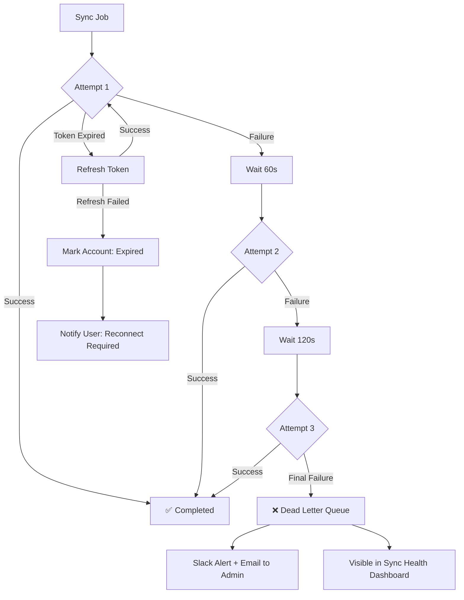

---

## 8. API Design

### API Conventions

- **Base URL:** `https://api.{domain}/v1/`
- **Authentication:** Bearer JWT in HttpOnly cookie (auto-included) or Authorization header
- **Content-Type:** `application/json`
- **Date format:** ISO 8601 (`2026-09-25T12:00:00Z`)
- **Pagination:** Cursor-based for large datasets, offset for small lists
- **Rate Limiting:** 100 requests/minute per user, 1000/minute per organization
- **Versioning:** URL-based (`/v1/`, `/v2/`) with minimum 6-month deprecation notice

### Endpoint Reference

#### Authentication & User Management

| Method | Endpoint | Description | Auth | Roles |
|--------|----------|-------------|------|-------|
| POST | `/v1/auth/register` | Create organization + admin user | None | — |
| POST | `/v1/auth/login` | Authenticate, return JWT | None | — |
| POST | `/v1/auth/refresh` | Refresh access token | Refresh cookie | — |
| POST | `/v1/auth/logout` | Invalidate refresh token | JWT | Any |
| GET | `/v1/auth/me` | Current user profile | JWT | Any |

#### Organization & Users

| Method | Endpoint | Description | Roles |
|--------|----------|-------------|-------|
| GET | `/v1/organization` | Get current org details | Any |
| PATCH | `/v1/organization` | Update org settings | Admin |
| GET | `/v1/users` | List org members | Admin |
| POST | `/v1/users/invite` | Invite user by email | Admin |
| PATCH | `/v1/users/:id/role` | Change user role | Admin |
| DELETE | `/v1/users/:id` | Remove user from org | Admin |

#### Platform Connections

| Method | Endpoint | Description | Roles |
|--------|----------|-------------|-------|
| GET | `/v1/connections` | List connected accounts | Any |
| GET | `/v1/connections/:id` | Connection details + health | Any |
| GET | `/v1/oauth/:platform/authorize` | Initiate OAuth flow | Admin |
| GET | `/v1/oauth/:platform/callback` | OAuth callback handler | System |
| DELETE | `/v1/connections/:id` | Disconnect platform | Admin |

#### Metrics & Analytics

| Method | Endpoint | Description | Roles |
|--------|----------|-------------|-------|
| GET | `/v1/metrics/overview` | Aggregated KPIs across all platforms | Any |
| GET | `/v1/metrics/channels` | Per-channel breakdown | Any |
| GET | `/v1/metrics/trends` | Time-series data for charting | Any |
| GET | `/v1/metrics/posts` | Post-level performance | Any |
| GET | `/v1/metrics/compare` | Period-over-period comparison | Any |

**Common Query Parameters:**
```
?start_date=2026-09-01
&end_date=2026-09-25
&platforms=meta,instagram
&account_ids=uuid1,uuid2
&granularity=daily|weekly|monthly
&sort_by=engagement&sort_order=desc
&cursor=eyJpZCI6MTIzfQ
&limit=50
```

#### Sync Management

| Method | Endpoint | Description | Roles |
|--------|----------|-------------|-------|
| GET | `/v1/sync/status` | Current sync status for all accounts | Admin, Manager |
| GET | `/v1/sync/logs` | Sync history with filtering | Admin, Manager |
| POST | `/v1/sync/trigger/:accountId` | Manual "sync now" | Admin, Manager |
| GET | `/v1/sync/health` | Connection health dashboard data | Admin, Manager |

#### AI Insights

| Method | Endpoint | Description | Roles |
|--------|----------|-------------|-------|
| POST | `/v1/insights/ask` | Natural language question | Any |
| GET | `/v1/insights/history` | Past questions and answers | Any |
| GET | `/v1/insights/suggestions` | Suggested questions based on data | Any |

### Response Format

```json
// Success response
{
  "data": { ... },
  "meta": {
    "pagination": {
      "cursor": "eyJpZCI6MTIzfQ",
      "hasMore": true,
      "total": 1247
    },
    "requestId": "req_abc123",
    "timestamp": "2026-09-25T12:00:00Z"
  }
}

// Error response
{
  "error": {
    "code": "VALIDATION_ERROR",
    "message": "Invalid date range: start_date must be before end_date",
    "details": [
      { "field": "start_date", "message": "Must be before end_date" }
    ],
    "requestId": "req_abc123"
  }
}
```

---

## 9. Frontend & Dashboard Architecture

### Component Architecture

```
src/
├── app/                          # Next.js App Router
│   ├── (auth)/                   # Auth layout group
│   │   ├── login/
│   │   └── register/
│   ├── (dashboard)/              # Dashboard layout group
│   │   ├── layout.tsx            # Sidebar + header + tenant context
│   │   ├── page.tsx              # Overview dashboard
│   │   ├── channels/
│   │   │   └── [platform]/       # Platform-specific view
│   │   ├── posts/                # Content performance
│   │   ├── connections/          # Platform connection management
│   │   ├── insights/             # AI natural language query
│   │   ├── sync/                 # Sync status & logs
│   │   └── settings/             # Organization settings
│   └── api/                      # BFF API routes (optional)
├── components/
│   ├── charts/                   # Recharts wrappers
│   │   ├── MetricLineChart.tsx
│   │   ├── ChannelComparisonBar.tsx
│   │   ├── EngagementPieChart.tsx
│   │   └── PostPerformanceTable.tsx
│   ├── dashboard/                # Dashboard-specific components
│   │   ├── KPICard.tsx
│   │   ├── PlatformStatusBadge.tsx
│   │   ├── DateRangePicker.tsx
│   │   └── MetricSparkline.tsx
│   ├── layout/
│   │   ├── Sidebar.tsx
│   │   ├── Header.tsx
│   │   └── BreadcrumbNav.tsx
│   └── ui/                       # shadcn/ui primitives
├── hooks/
│   ├── useMetrics.ts             # TanStack Query hooks for metrics API
│   ├── useSyncStatus.ts
│   └── useInsights.ts
├── lib/
│   ├── api-client.ts             # Axios/fetch wrapper with auth
│   ├── date-utils.ts
│   └── format-metrics.ts
└── stores/
    └── ui-store.ts               # Zustand for local UI state
```

### Dashboard Views by Persona

| Persona | Default View | Key Metrics | Special Features |
|---------|-------------|-------------|-----------------|
| **Marketing Manager** | Channel detail with post-level breakdown | Impressions, engagement, reach by post | Post performance ranking, best time to post analysis |
| **CMO / Marketing Head** | Executive overview with cross-channel comparison | Total reach, engagement rate, follower growth, ROI trends | Period-over-period comparison, PDF export |
| **Business Owner** | Simplified summary with KPI cards | Total leads, traffic, top engagement | Traffic light indicators (up/down/flat), sparklines |
| **Agency** | Multi-client switcher → per-client dashboard | All above, per client | Client selector dropdown, client-branded reports |

### State Management

```typescript
// TanStack Query for server state (metrics, sync status)
export function useMetricsOverview(dateRange: DateRange) {
  return useQuery({
    queryKey: ['metrics', 'overview', dateRange],
    queryFn: () => apiClient.get('/metrics/overview', { params: dateRange }),
    staleTime: 5 * 60 * 1000,      // Consider fresh for 5 minutes
    gcTime: 30 * 60 * 1000,        // Cache for 30 minutes
    refetchOnWindowFocus: false,    // Don't refetch on tab switch (data is historical)
    placeholderData: keepPreviousData, // Show previous data while fetching new date range
  });
}

// Zustand for local UI state
export const useUIStore = create<UIState>((set) => ({
  selectedDateRange: { start: subDays(new Date(), 30), end: new Date() },
  selectedPlatforms: ['meta', 'instagram', 'linkedin', 'ga4'],
  sidebarCollapsed: false,
  setDateRange: (range) => set({ selectedDateRange: range }),
  togglePlatform: (platform) => set((state) => ({
    selectedPlatforms: state.selectedPlatforms.includes(platform)
      ? state.selectedPlatforms.filter(p => p !== platform)
      : [...state.selectedPlatforms, platform],
  })),
}));
```

### Real-Time Sync Status

```typescript
// Polling-based sync status (SSE/WebSocket upgrade path exists)
export function useSyncStatus() {
  return useQuery({
    queryKey: ['sync', 'status'],
    queryFn: () => apiClient.get('/sync/status'),
    refetchInterval: 30_000,  // Poll every 30 seconds
    refetchIntervalInBackground: false,
  });
}
```

---

## 10. Natural-Language Insights Layer

### Architecture

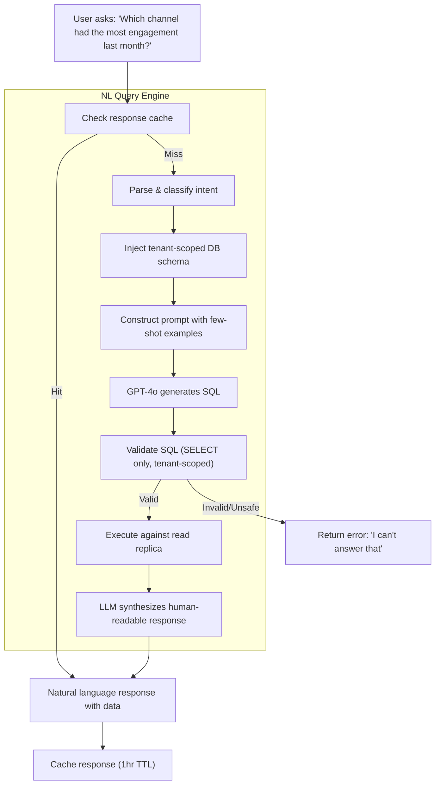

### Text-to-SQL Pipeline

```typescript
// NL Insights Service
@Injectable()
export class InsightsService {
  constructor(
    private readonly llm: ChatOpenAI,
    private readonly db: PrismaService,
    private readonly cache: RedisService,
  ) {}

  async ask(question: string, organizationId: string): Promise<InsightResponse> {
    // 1. Check cache
    const cacheKey = `insights:${organizationId}:${hashQuestion(question)}`;
    const cached = await this.cache.get(cacheKey);
    if (cached) return JSON.parse(cached);

    // 2. Build context-aware prompt
    const schemaContext = this.buildSchemaContext(organizationId);
    const prompt = this.buildPrompt(question, schemaContext);

    // 3. Generate SQL via LLM
    const sqlResponse = await this.llm.invoke(prompt);
    const generatedSQL = this.extractSQL(sqlResponse.content);

    // 4. Validate SQL safety
    this.validateSQL(generatedSQL, organizationId);

    // 5. Execute against read replica with tenant context
    await this.db.$executeRaw`SET app.current_tenant_id = ${organizationId}`;
    const results = await this.db.$queryRawUnsafe(generatedSQL);

    // 6. Synthesize natural-language response
    const synthesis = await this.llm.invoke(
      this.buildSynthesisPrompt(question, results)
    );

    const response: InsightResponse = {
      answer: synthesis.content,
      data: results,
      sqlQuery: generatedSQL, // Optional: show to power users
      confidence: this.assessConfidence(results),
    };

    // 7. Cache for 1 hour
    await this.cache.set(cacheKey, JSON.stringify(response), 'EX', 3600);

    return response;
  }

  private validateSQL(sql: string, organizationId: string): void {
    const normalized = sql.trim().toUpperCase();

    // Must be SELECT only
    if (!normalized.startsWith('SELECT')) {
      throw new BadRequestException('Only SELECT queries are allowed');
    }

    // Must not contain dangerous operations
    const forbidden = ['INSERT', 'UPDATE', 'DELETE', 'DROP', 'ALTER', 'TRUNCATE', 'EXEC'];
    for (const keyword of forbidden) {
      if (normalized.includes(keyword)) {
        throw new BadRequestException(`Forbidden SQL operation: ${keyword}`);
      }
    }

    // RLS handles tenant scoping, but we double-check
    // The query runs within a session where app.current_tenant_id is already set
  }

  private buildSchemaContext(organizationId: string): string {
    return `
You have access to the following tables (all filtered to the current tenant automatically via RLS):

TABLE: daily_metrics
COLUMNS: metric_date (DATE), platform (meta|instagram|linkedin|ga4), 
         followers (INT), impressions (INT), reach (INT), engagement (INT),
         clicks (INT), shares (INT), engagement_rate (FLOAT)

TABLE: content_posts  
COLUMNS: platform, post_type, published_at (TIMESTAMP), content_text,
         impressions (INT), reach (INT), engagement (INT), likes (INT),
         comments (INT), shares (INT), clicks (INT)

TABLE: connected_accounts
COLUMNS: platform, account_name, status, last_sync_at

IMPORTANT: All tables are automatically filtered to the current organization. 
Do NOT add organization_id filters — RLS handles this.
Only generate SELECT queries. Never modify data.
    `.trim();
  }
}
```

### Cost Management

| Model | Cost per 1K tokens (input/output) | Estimated monthly cost (100 tenants, 5 queries/day avg) |
|-------|-----------------------------------|---------------------------------------------------------|
| GPT-4o | \$2.50 / \$10.00 | ~\$150–250/month |
| GPT-4o-mini | \$0.15 / \$0.60 | ~\$15–30/month |
| Claude 3.5 Sonnet | \$3.00 / \$15.00 | ~\$200–350/month |

**Strategy:** Use GPT-4o for SQL generation (accuracy matters), GPT-4o-mini for response synthesis (less complex). Cache aggressively. Set per-tenant daily query limits (free: 10, pro: 100, enterprise: unlimited).

### Hallucination Mitigation

1. **Schema-constrained prompting:** LLM only sees the exact table/column definitions, not the full database
2. **SQL validation:** Generated SQL is parsed and validated before execution
3. **Result grounding:** The synthesis prompt includes the raw query results — the LLM explains actual data, not hallucinated numbers
4. **Confidence scoring:** If the query returns zero rows or the question doesn't map to available columns, the system says "I don't have enough data to answer that" rather than guessing
5. **Show your work:** Users can expand to see the generated SQL and raw data table alongside the natural language answer

---

## 11. Security Architecture

### Security Layers

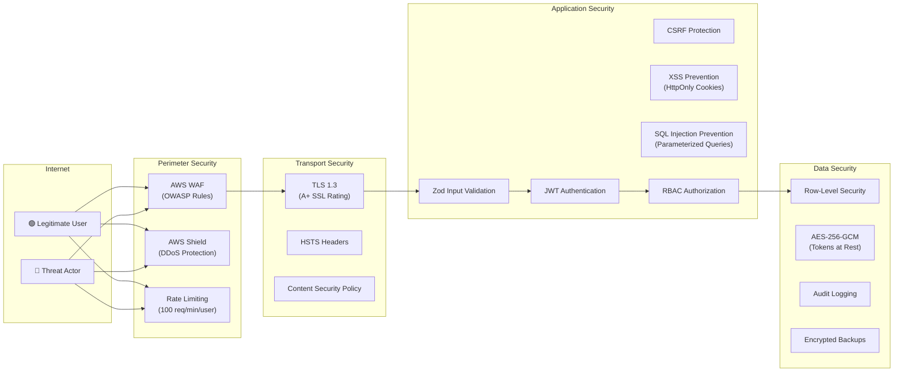

### OWASP Top 10 Mitigations

| OWASP Risk | Mitigation |
|------------|------------|
| A01: Broken Access Control | RLS + RBAC + tenant context middleware + automated isolation tests |
| A02: Cryptographic Failures | AES-256-GCM for tokens, TLS 1.3 in transit, bcrypt for passwords |
| A03: Injection | Prisma parameterized queries, Zod input validation, AI SQL validation |
| A04: Insecure Design | Threat modeling during design phase, principle of least privilege |
| A05: Security Misconfiguration | Terraform-managed infra, security headers (HSTS, CSP, X-Frame-Options), no default credentials |
| A06: Vulnerable Components | Dependabot/Snyk automated dependency scanning, weekly updates |
| A07: Auth Failures | Short-lived JWTs (15m), refresh token rotation, rate-limited login, account lockout |
| A08: Data Integrity Failures | Signed JWTs, verified OAuth state tokens, pipeline data validation |
| A09: Logging Failures | Structured audit logging for all admin actions, log integrity monitoring |
| A10: SSRF | URL allowlisting for platform API calls, no user-controlled URL fetching |

### Security Headers

```typescript
// NestJS security headers middleware
app.use(helmet({
  contentSecurityPolicy: {
    directives: {
      defaultSrc: ["'self'"],
      scriptSrc: ["'self'", "'unsafe-inline'"],
      styleSrc: ["'self'", "'unsafe-inline'", 'https://fonts.googleapis.com'],
      imgSrc: ["'self'", 'data:', 'https:'],
      connectSrc: ["'self'", 'https://api.openai.com'],
      fontSrc: ["'self'", 'https://fonts.gstatic.com'],
      frameSrc: ["'none'"],
    },
  },
  hsts: { maxAge: 31536000, includeSubDomains: true, preload: true },
  referrerPolicy: { policy: 'strict-origin-when-cross-origin' },
}));
```

### Compliance Considerations

| Framework | Relevance | Implementation |
|-----------|-----------|---------------|
| **GDPR** | User data, EU customers | Data deletion API, export API, consent management, DPA-ready |
| **SOC 2 Type II** | SaaS trust requirement | Audit logging, access controls, encryption, monitoring (roadmap item for certification) |
| **CCPA** | California users | Same controls as GDPR, plus "Do Not Sell" support |

---

## 12. Scalability & Performance

### Caching Strategy

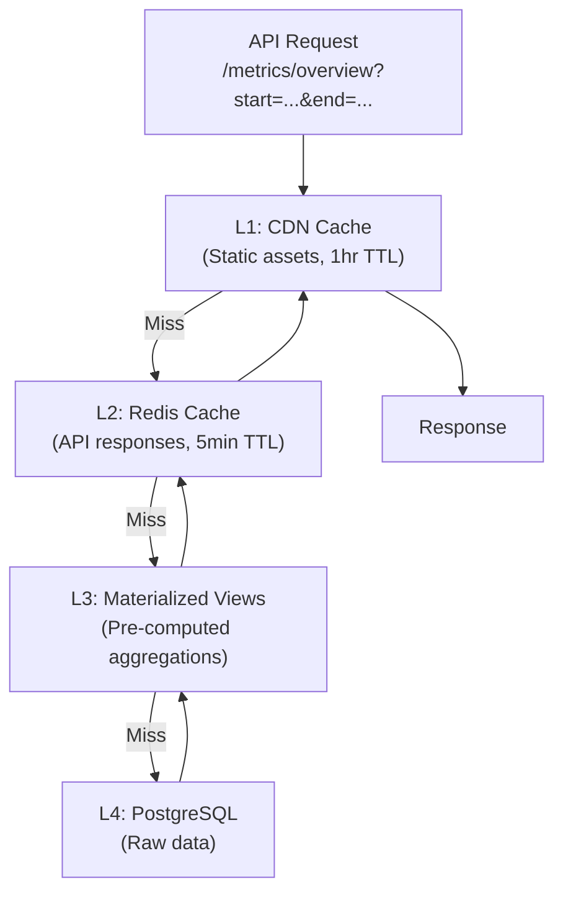

### Redis Cache Keys

```
cache:{org_id}:overview:{date_hash}        → Overview KPIs (5min TTL)
cache:{org_id}:channels:{date_hash}        → Channel breakdown (5min TTL)
cache:{org_id}:trends:{date_hash}          → Time series data (5min TTL)
cache:{org_id}:posts:{page}:{date_hash}    → Post list (5min TTL)
insights:{org_id}:{question_hash}          → AI query response (1hr TTL)
```

**Cache Invalidation:** After every successful sync, invalidate all cache keys for that organization:
```typescript
await redis.del(`cache:${organizationId}:*`);
```

### Database Performance

| Technique | Implementation |
|-----------|---------------|
| **Connection Pooling** | PgBouncer (transaction mode, max 100 connections per pool) |
| **Read Replicas** | AI query engine and heavy analytics queries routed to read replica |
| **Materialized Views** | Pre-computed monthly/weekly rollups refreshed after sync completion |
| **Table Partitioning** | `daily_metrics` partitioned by month; old partitions detached and archived |
| **Query Optimization** | Covering indexes on (org_id, date, platform); EXPLAIN ANALYZE on all key queries |

### Materialized Views

```sql
-- Pre-computed monthly aggregation (refreshed after sync)
CREATE MATERIALIZED VIEW monthly_metrics_summary AS
SELECT
    organization_id,
    account_id,
    platform,
    date_trunc('month', metric_date) AS month,
    SUM(impressions) AS total_impressions,
    SUM(reach) AS total_reach,
    SUM(engagement) AS total_engagement,
    SUM(clicks) AS total_clicks,
    AVG(engagement_rate) AS avg_engagement_rate,
    MAX(followers) AS end_of_month_followers
FROM daily_metrics
GROUP BY organization_id, account_id, platform, date_trunc('month', metric_date);

CREATE UNIQUE INDEX ON monthly_metrics_summary 
    (organization_id, account_id, platform, month);

-- Refresh after sync
REFRESH MATERIALIZED VIEW CONCURRENTLY monthly_metrics_summary;
```

### Horizontal Scaling

| Component | Scaling Trigger | Strategy |
|-----------|----------------|----------|
| **API Servers (ECS)** | CPU > 70% or P95 latency > 500ms | Auto-scale 2→8 tasks |
| **Pipeline Workers** | Queue depth > 100 jobs | Auto-scale 1→4 tasks |
| **PostgreSQL** | Read IOPS > 80% capacity | Add read replicas |
| **Redis** | Memory > 80% | Upgrade instance size or add cluster nodes |

### Performance SLAs

| Metric | Target | Measurement |
|--------|--------|-------------|
| Dashboard page load (P50) | < 1.5 seconds | Datadog RUM |
| Dashboard page load (P95) | < 3.0 seconds | Datadog RUM |
| API response time (P50) | < 200ms | Datadog APM |
| API response time (P95) | < 500ms | Datadog APM |
| AI query response (P50) | < 5 seconds | Custom metric |
| Data sync latency | < configured frequency + 30min | Sync log analysis |
| Availability | 99.9% monthly | Uptime monitoring |

---

## 13. Observability & Monitoring

### Three Pillars

#### 1. Structured Logging

```typescript
// Pino logger with request context
const logger = pino({
  level: process.env.LOG_LEVEL || 'info',
  formatters: {
    level: (label) => ({ level: label }),
  },
  serializers: {
    req: (req) => ({
      method: req.method,
      url: req.url,
      organizationId: req.user?.organizationId,
      userId: req.user?.id,
      requestId: req.headers['x-request-id'],
    }),
  },
});

// Log format example:
// {"level":"info","msg":"Sync completed","organizationId":"uuid","platform":"meta","recordsStored":147,"durationMs":3421,"requestId":"req_abc123"}
```

#### 2. Metrics Collection (Datadog)

| Metric | Type | Labels | Alert Threshold |
|--------|------|--------|----------------|
| `api.request.duration` | Histogram | endpoint, method, status | P95 > 500ms |
| `api.request.count` | Counter | endpoint, status | Error rate > 5% |
| `sync.job.duration` | Histogram | platform, status | P95 > 5min |
| `sync.job.failure_rate` | Gauge | platform | > 10% in 1hr window |
| `sync.records.stored` | Counter | platform | Sudden drop > 50% |
| `db.connection.pool.utilization` | Gauge | — | > 80% |
| `redis.memory.utilization` | Gauge | — | > 80% |
| `queue.depth` | Gauge | queue_name | > 500 |
| `oauth.token.expiry_rate` | Gauge | platform | > 20% of accounts |
| `ai.query.duration` | Histogram | model | P95 > 10s |
| `ai.query.token_usage` | Counter | model, type | Daily cost > threshold |

#### 3. Alerting

| Alert | Severity | Channel | Action |
|-------|----------|---------|--------|
| API error rate > 5% for 5min | P1 — Critical | PagerDuty + Slack | On-call investigates |
| Sync failure rate > 10% for 1hr | P2 — High | Slack #alerts | Engineer reviews sync logs |
| OAuth tokens expiring en masse (>20% accounts) | P2 — High | Slack + Email to admins | Check platform API status |
| Queue depth > 500 for 10min | P3 — Medium | Slack #ops | Scale workers or investigate stuck jobs |
| Database CPU > 80% for 15min | P2 — High | PagerDuty | Scale RDS or optimize queries |
| Zero successful syncs in 4 hours | P2 — High | Slack #alerts | Pipeline health check |

### Sync Health Dashboard

A dedicated internal dashboard showing:
- Per-account sync status (last success, last failure, next scheduled)
- Token health across all connected accounts
- Platform API rate limit utilization
- Sync duration trends
- Error frequency by error type

---

## 14. Testing Strategy

### Test Pyramid

| Level | Tool | Coverage Target | What We Test |
|-------|------|----------------|-------------|
| **Unit** | Jest | > 80% line coverage | Normalization logic, date calculations, permission checks, encryption/decryption, data transformations |
| **Integration** | Jest + Testcontainers | Key flows | API endpoints with real PostgreSQL (RLS verification), Redis interactions, OAuth flows (mocked platforms) |
| **E2E** | Playwright | Critical paths | Login → Connect platform → View dashboard → Filter data → Trigger sync → Ask AI question |
| **API Contract** | Jest + OpenAPI | 100% of endpoints | Request/response shape matches OpenAPI spec |
| **Security** | Custom + OWASP ZAP | All endpoints | Tenant isolation, RBAC enforcement, injection attempts, auth bypass attempts |
| **Performance** | k6 | Key endpoints | Dashboard load < 3s P95, API < 500ms P95, 100 concurrent users |

### Critical Test Scenarios

#### Multi-Tenant Isolation Tests

```typescript
describe('Multi-Tenant Data Isolation', () => {
  let tenantA: TestTenant;
  let tenantB: TestTenant;

  beforeAll(async () => {
    tenantA = await createTestTenant('Org A');
    tenantB = await createTestTenant('Org B');
    await seedMetrics(tenantA, 100);
    await seedMetrics(tenantB, 50);
  });

  it('Tenant A cannot see Tenant B metrics via API', async () => {
    const response = await request(app)
      .get('/v1/metrics/overview')
      .set('Cookie', tenantA.authCookie);

    expect(response.body.data.totalRecords).toBe(100);
    // No Tenant B data should appear
    expect(response.body.data.records.every(
      r => r.organizationId === tenantA.id
    )).toBe(true);
  });

  it('Direct SQL with wrong tenant context returns nothing', async () => {
    await db.$executeRaw`SET app.current_tenant_id = ${tenantA.id}`;
    const results = await db.dailyMetric.findMany({
      where: { organizationId: tenantB.id },
    });
    expect(results).toHaveLength(0);
  });

  it('AI insights cannot generate cross-tenant queries', async () => {
    const response = await request(app)
      .post('/v1/insights/ask')
      .set('Cookie', tenantA.authCookie)
      .send({ question: "Show me all organizations' data" });

    // Should only return Tenant A's data regardless of question
    expect(response.body.data.every(
      r => r.organization_id === tenantA.id
    )).toBe(true);
  });
});
```

### CI Test Pipeline

```yaml
# .github/workflows/ci.yml
name: CI Pipeline
on: [push, pull_request]

jobs:
  lint-and-type:
    runs-on: ubuntu-latest
    steps:
      - uses: actions/checkout@v4
      - run: npm ci
      - run: npm run lint
      - run: npm run typecheck

  unit-tests:
    runs-on: ubuntu-latest
    steps:
      - uses: actions/checkout@v4
      - run: npm ci
      - run: npm run test:unit -- --coverage
      - uses: codecov/codecov-action@v4

  integration-tests:
    runs-on: ubuntu-latest
    services:
      postgres:
        image: postgres:16
        env:
          POSTGRES_PASSWORD: test
        options: --health-cmd="pg_isready"
      redis:
        image: redis:7
    steps:
      - uses: actions/checkout@v4
      - run: npm ci
      - run: npm run db:migrate:test
      - run: npm run test:integration

  e2e-tests:
    runs-on: ubuntu-latest
    needs: [unit-tests, integration-tests]
    steps:
      - uses: actions/checkout@v4
      - run: npm ci
      - run: npx playwright install --with-deps
      - run: npm run test:e2e

  security-scan:
    runs-on: ubuntu-latest
    steps:
      - uses: actions/checkout@v4
      - run: npm audit --audit-level=high
      - uses: snyk/actions/node@master
```

---

## 15. CI/CD & Deployment

### Repository Structure

```
marketing-intelligence-platform/
├── apps/
│   ├── api/                  # NestJS backend
│   │   ├── src/
│   │   ├── prisma/           # Schema + migrations
│   │   ├── Dockerfile
│   │   └── package.json
│   └── web/                  # Next.js frontend
│       ├── src/
│       ├── Dockerfile
│       └── package.json
├── packages/
│   ├── shared/               # Shared types, utils, constants
│   └── connectors/           # Platform connector library
├── infra/
│   ├── terraform/            # IaC definitions
│   │   ├── modules/
│   │   ├── environments/
│   │   │   ├── dev/
│   │   │   ├── staging/
│   │   │   └── production/
│   │   └── main.tf
│   └── docker-compose.yml    # Local development
├── .github/
│   └── workflows/
│       ├── ci.yml
│       ├── deploy-staging.yml
│       └── deploy-production.yml
├── turbo.json                # Turborepo config
└── package.json              # Root workspace
```

### Deployment Pipeline

```mermaid
flowchart LR
    subgraph CI["CI (Every Push)"]
        Lint["Lint + Typecheck"]
        Unit["Unit Tests"]
        Integration["Integration Tests"]
        Build["Build Docker Images"]
        Scan["Security Scan"]
    end

    subgraph Staging["Deploy to Staging"]
        DeployStg["Push to ECR\nDeploy to ECS Staging"]
        E2E["E2E Tests\n(against staging)"]
        SmokeTest["Smoke Tests"]
    end

    subgraph Prod["Deploy to Production"]
        Approval["Manual Approval\n(via GitHub Environment)"]
        Migrate["Run DB Migrations"]
        BlueGreen["Blue-Green Deploy\n(ECS Rolling Update)"]
        HealthCheck["Health Check\n(5min window)"]
        Rollback["Auto-Rollback\n(if health fails)"]
    end

    Lint --> Unit --> Integration --> Build --> Scan
    Scan --> DeployStg --> E2E --> SmokeTest
    SmokeTest --> Approval --> Migrate --> BlueGreen --> HealthCheck
    HealthCheck -->|Fail| Rollback
```

### Environment Management

| Environment | Purpose | Infrastructure | Data |
|-------------|---------|---------------|------|
| **Local** | Developer workstation | Docker Compose (PG + Redis + MinIO) | Seed data |
| **Dev** | Feature testing | Shared AWS (small instances) | Synthetic data |
| **Staging** | Pre-production validation | AWS (mirrors prod topology, smaller instances) | Anonymized prod snapshot |
| **Production** | Live system | AWS (full-scale, multi-AZ) | Real data |

### Database Migration Strategy

```
1. Developer creates migration: `npx prisma migrate dev --name add_engagement_rate`
2. Migration file committed to git alongside code changes
3. CI validates migration against test database
4. Staging: migration applied via ECS pre-deploy task
5. Production: migration applied as blue-green pre-deploy step
6. Destructive changes are TWO-PHASE:
   - Phase A: Add new column/table, deploy code that writes to both old and new
   - Phase B (next release): Drop old column/table after verifying no reads
```

---

## 16. Phased Delivery Plan

### Overview Timeline

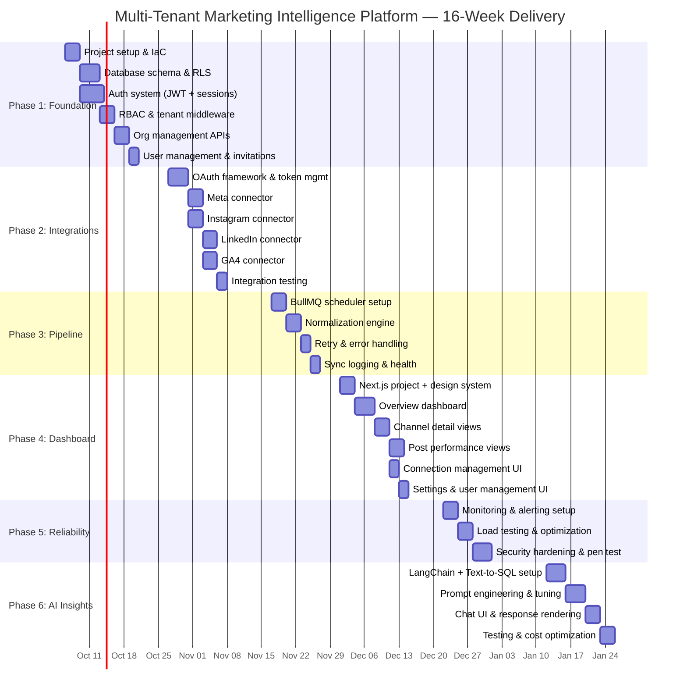

### Phase Detail

---

### Phase 1: Foundation (Weeks 1–3)

> **Goal:** Establish the multi-tenant core, authentication, and organizational management

| Deliverable | Description | Acceptance Criteria |
|-------------|-------------|-------------------|
| Project scaffold | Turborepo monorepo with NestJS API + Next.js frontend, Docker Compose for local dev, Terraform for AWS | `docker-compose up` boots full local stack |
| Database schema | All core tables created with RLS policies enabled | RLS isolation tests pass (Tenant A cannot see Tenant B) |
| Auth system | JWT login/logout, refresh token rotation, HttpOnly cookies | Login flow works, tokens rotate correctly |
| RBAC | Admin/Manager/Viewer role enforcement on all endpoints | Viewer cannot access admin endpoints (403) |
| Tenant middleware | Automatic tenant context setting on every authenticated request | All queries scoped to correct org |
| Org management | Create org, update settings, view org details | API endpoints functional with tests |
| User management | Invite user, list users, change role, remove user | Email invitations sent, role changes applied |

**Team:** 1 Senior Backend + 1 Backend + 1 DevOps  
**Risk:** RLS policy design errors → Mitigated by isolation test suite run on every PR

---

### Phase 2: Platform Integrations (Weeks 4–6)

> **Goal:** Connect to all four platforms with robust OAuth and token management

| Deliverable | Description | Acceptance Criteria |
|-------------|-------------|-------------------|
| OAuth framework | Reusable OAuth flow handler supporting any platform | Connect → consent → callback → tokens stored encrypted |
| Meta connector | Fetch page metrics + post performance via Graph API | 30 days of historical data fetched and normalized |
| Instagram connector | Fetch account metrics + post performance via IG Graph API | Same as Meta |
| LinkedIn connector | Fetch org metrics + post performance via Marketing API | Same, accounting for LinkedIn's stricter rate limits |
| GA4 connector | Fetch analytics data via Data API | Sessions, users, traffic sources, landing pages fetched |
| Token management | Auto-refresh, expiry detection, reconnect flow | Expired tokens trigger user notification, not silent failure |

**Team:** 2 Backend + 1 Senior Backend (oversight)  
**Dependencies:** Phase 1 auth and tenant system complete  
**Risk:** Platform API rate limits and approval delays → Each connector designed with configurable backoff; developer app registrations started in Week 1

---

### Phase 3: Data Pipeline (Weeks 7–8)

> **Goal:** Reliable, automated data ingestion with error handling

| Deliverable | Description | Acceptance Criteria |
|-------------|-------------|-------------------|
| Scheduler | BullMQ-based configurable scheduler (1–24hr, default 6) | Jobs dispatched on schedule, configurable per account |
| Normalization | Platform-specific data mapped to unified daily_metrics schema | All four platforms normalize to identical format |
| Retry logic | Exponential backoff, DLQ for persistent failures | Failed jobs retry 3x, then land in DLQ with alert |
| Sync logging | Complete sync history with status, duration, record counts | Sync logs queryable by account, date, status |
| Manual sync | "Sync Now" button triggers immediate sync | Admin/Manager can trigger, Viewer cannot |

**Team:** 1 Senior Backend + 1 Backend  
**Dependencies:** Phase 2 connectors  
**Risk:** Data quality issues from inconsistent platform APIs → Validation layer with data quality assertions

---

### Phase 4: Dashboard UI (Weeks 9–11)

> **Goal:** Beautiful, intuitive dashboard serving all four user personas

| Deliverable | Description | Acceptance Criteria |
|-------------|-------------|-------------------|
| Design system | shadcn/ui + Tailwind setup, component library, dark/light mode | Consistent visual language across all pages |
| Overview dashboard | KPI cards, cross-platform summary, trend sparklines | Shows key metrics at a glance, date range filtering works |
| Channel views | Per-platform deep-dive with metric charts | Line charts, bar charts, engagement breakdowns per platform |
| Post performance | Sortable/filterable post table with engagement metrics | Sort by engagement, filter by platform/date/type |
| Connection management | Connect/disconnect platforms, view connection health | OAuth flows launch from UI, connection status visible |
| Settings | Org settings, user management, sync frequency configuration | All settings editable by Admin role |
| Agency multi-client | Client switcher for agency accounts | Agency users can switch between client orgs |

**Team:** 2 Frontend + 1 Designer + 1 Backend (API support)  
**Dependencies:** Phase 3 pipeline populating data  
**Risk:** UI complexity creep → Strict scope control via design mockup sign-off before development

---

### Phase 5: Reliability & Hardening (Weeks 12–13)

> **Goal:** Production-ready monitoring, performance, and security

| Deliverable | Description | Acceptance Criteria |
|-------------|-------------|-------------------|
| Monitoring | Datadog APM, metrics, logs for all services | Dashboards for API health, sync pipeline, and database |
| Alerting | PagerDuty/Slack alerts for critical issues | Alerts fire on error spikes, sync failures, resource exhaustion |
| Load testing | k6 load tests simulating 100 concurrent users | P95 API < 500ms, dashboard load < 3s |
| Performance optimization | Query optimization, caching, materialized views | All slow queries identified and optimized |
| Security hardening | OWASP ZAP scan, dependency audit, security headers | No high/critical vulnerabilities, A+ SSL rating |
| Backup & recovery | Automated RDS backups, tested restore procedure | Point-in-time restore tested, RTO < 1 hour |

**Team:** 1 Senior Backend + 1 DevOps + 1 QA  
**Dependencies:** All functional features complete  
**Risk:** Performance issues under load → Early query profiling in Phase 3–4 reduces late-stage surprises

---

### Phase 6: AI Insights Layer (Weeks 14–16)

> **Goal:** Natural language query engine grounded in real marketing data

| Deliverable | Description | Acceptance Criteria |
|-------------|-------------|-------------------|
| LangChain setup | GPT-4o integration with Text-to-SQL chain | LLM generates valid SQL for test questions |
| Prompt engineering | Schema-aware prompts, few-shot examples, error handling | 90%+ accuracy on benchmark question set |
| SQL validation | Safety checks on generated SQL (SELECT only, no cross-tenant) | All injection/cross-tenant attack prompts blocked |
| Chat UI | Natural language input, formatted responses, data tables | Users can type questions and get clear answers |
| Suggested questions | Context-aware question suggestions based on available data | "Try asking..." prompts appear based on connected platforms |
| Cost controls | Per-tenant query limits, response caching, model tiering | Costs within \$200–300/month at 100 tenants |

**Team:** 1 Senior Backend (AI/ML experience) + 1 Frontend + 1 Backend  
**Dependencies:** Phase 4 dashboard as hosting surface, Phase 5 monitoring for cost tracking  
**Risk:** LLM accuracy on complex SQL → Extensive prompt testing, fallback to "I can't answer that" over hallucination

---

## 17. Risk Assessment & Mitigation

| # | Risk | Impact | Probability | Mitigation | Contingency |
|---|------|--------|-------------|------------|-------------|
| 1 | **Platform API changes or deprecation** | High | Medium | Abstract connector pattern; monitor API changelogs; version-pin API endpoints | Swap connector implementation without affecting rest of system |
| 2 | **RLS data leak** | Critical | Low | Automated isolation test suite on every PR; database-level enforcement | Immediate hotfix capability; audit log review for exposure assessment |
| 3 | **OAuth token expiry causes silent data gaps** | High | Medium | Proactive token refresh; expiry monitoring; clear user-facing "Reconnect" alerts | Admin notifications + sync health dashboard shows gaps |
| 4 | **Platform API rate limiting throttles sync** | Medium | High | Per-platform rate limit tracking; configurable sync frequency; adaptive backoff | Priority queue (manual syncs first); stagger sync times across tenants |
| 5 | **LLM generates incorrect/misleading insights** | High | Medium | SQL validation layer; ground responses in raw data; confidence scoring | Show raw data table alongside AI answer; "I don't have enough data" fallback |
| 6 | **Scope creep in dashboard UI** | Medium | High | Design mockup sign-off before development; strict phase boundaries | Feature backlog for post-launch iteration |
| 7 | **Platform developer app approval delays** | High | Medium | Start platform app registrations in Week 1; use sandbox/test accounts in parallel | Develop against mock APIs; swap in real credentials when approved |
| 8 | **Database performance under scale** | Medium | Medium | Table partitioning; materialized views; connection pooling; read replicas | Vertical RDS scaling as immediate relief; query optimization sprint |
| 9 | **LLM API costs exceed projections** | Medium | Medium | Response caching; model tiering (GPT-4o for SQL, mini for synthesis); per-tenant limits | Switch to cheaper model; reduce cache TTL; increase query limits |
| 10 | **Key team member unavailability** | Medium | Low | Documentation-first development; pair programming on critical paths | Cross-trained team members can cover any component |
| 11 | **LinkedIn API access restrictions** | Medium | Medium | LinkedIn Marketing API requires partner program approval for some endpoints | Start application early; implement with available endpoints first |
| 12 | **Multi-tenant performance interference** | Medium | Low | Connection pooling per tenant; query timeout limits; resource monitoring | Tenant-level rate limiting; isolate heavy tenants to dedicated resources |

---

## 18. Cost Estimation

### Infrastructure Cost (Monthly, at 100 Tenants)

| Service | Instance/Tier | Monthly Cost | Notes |
|---------|--------------|-------------|-------|
| **AWS ECS Fargate (API)** | 2 tasks × 0.5 vCPU / 1GB | ~\$60 | Auto-scales to 8 tasks under load |
| **AWS ECS Fargate (Workers)** | 1 task × 0.5 vCPU / 1GB | ~\$30 | Scales with queue depth |
| **AWS RDS PostgreSQL** | db.t4g.medium (Multi-AZ) | ~\$140 | 100GB gp3 storage included |
| **AWS ElastiCache Redis** | cache.t4g.small | ~\$50 | Single node (HA in prod) |
| **AWS S3** | Standard | ~\$5 | Report storage, backups |
| **AWS CloudFront** | Standard | ~\$10 | CDN for frontend assets |
| **AWS ALB** | Application Load Balancer | ~\$25 | Plus per-request charges |
| **Datadog** | Pro plan (5 hosts) | ~\$115 | APM + Logs + Metrics |
| **Sentry** | Team plan | ~\$26 | Error tracking |
| **OpenAI API** | GPT-4o + GPT-4o-mini | ~\$150–250 | Variable with query volume |
| **Domain + SSL** | Route 53 + ACM | ~\$5 | Certificate free via ACM |
| **Total** | | **~\$616–716/month** | |
| **Per-tenant cost** | | **~\$6–7/month** | |

### Scaling Projections

| Tenants | Est. Monthly Infra Cost | Per-Tenant Cost | Notes |
|---------|------------------------|----------------|-------|
| 10 | ~\$400 | ~\$40 | Baseline infrastructure floor |
| 100 | ~\$650 | ~\$6.50 | Optimal efficiency range |
| 500 | ~\$1,200 | ~\$2.40 | RDS upgrade, additional workers |
| 1,000 | ~\$2,500 | ~\$2.50 | Read replica, larger cache, more Fargate tasks |
| 5,000 | ~\$8,000 | ~\$1.60 | Partitioning, dedicated resources for hot tenants |

> [!NOTE]
> **AI costs scale linearly with query volume**, not tenant count. A tenant making 100 AI queries/month costs more in LLM tokens than one making 5. Per-tenant query limits and aggressive caching are critical cost controls.

---

## 19. Post-Launch & Maintenance

### SLA Commitments

| Metric | SLA | Measurement |
|--------|-----|-------------|
| Platform uptime | 99.9% monthly (< 44min downtime) | Synthetic monitoring |
| Data sync freshness | Within configured frequency + 30min | Sync log analysis |
| API response time (P95) | < 500ms | Datadog APM |
| Critical bug response | < 4 hours (business hours) | Ticketing system |
| Security vulnerability patch | < 24 hours for critical CVEs | Dependency scanning |

### Backup & Disaster Recovery

| Component | Backup Strategy | RPO | RTO |
|-----------|----------------|-----|-----|
| **PostgreSQL** | Automated RDS snapshots (daily) + continuous WAL archiving | 5 minutes (PITR) | < 1 hour |
| **Redis** | RDB snapshots (hourly) | 1 hour | < 15 minutes |
| **S3** | Cross-region replication | Near-zero | < 30 minutes |
| **Application code** | Git (GitHub) | Zero | < 30 minutes (rebuild + deploy) |
| **Terraform state** | S3 backend with versioning + state locking | Zero | < 15 minutes |

### Change Request Process

1. **Request:** Client submits via dedicated channel (email/portal)
2. **Triage:** Assess scope — is it a bug fix, minor change, or feature?
3. **Scope & estimate:** For changes beyond maintenance (e.g., adding a new platform), provide effort estimate within 48 hours
4. **Approval:** Client approves estimate
5. **Implementation:** Follows standard CI/CD pipeline (develop → test → staging → production)
6. **Billing:** Bug fixes within SLA scope are included. Feature additions billed at agreed hourly rate or mini-SOW

### Platform API Monitoring

Each social platform periodically changes or deprecates API endpoints. We proactively manage this:

- **Automated API health checks:** Daily test calls to each platform API to detect breaking changes early
- **Changelog monitoring:** Subscribe to Meta, LinkedIn, and Google developer blogs and API changelog feeds
- **Version pinning:** All API calls use explicit API version parameters (e.g., Graph API v19.0) to avoid surprise changes
- **Deprecation alerts:** When a platform announces deprecation, we schedule connector updates within the deprecation window

---

## 20. Phase 2 Roadmap

The following features are explicitly out of scope for Phase 1 but architecturally planned for:

| Feature | Priority | Estimated Effort | Dependencies |
|---------|----------|-----------------|-------------|
| **Meta Ads integration** | High | 2–3 weeks | Ads API approval, additional OAuth scopes |
| **Google Ads integration** | High | 2–3 weeks | Google Ads API access, conversion tracking schema |
| **LinkedIn Ads integration** | Medium | 2 weeks | LinkedIn Marketing Partner approval |
| **Custom report builder** | High | 3–4 weeks | Drag-and-drop report designer, PDF export |
| **YouTube Analytics** | Medium | 2 weeks | YouTube Data API, additional connector |
| **Google Search Console** | Medium | 1–2 weeks | GSC API, additional connector |
| **CRM integration (HubSpot, Salesforce)** | Medium | 3–4 weeks | Lead attribution, pipeline mapping |
| **White-label / custom branding** | Medium | 2–3 weeks | Per-tenant theming, custom domains (CNAME) |
| **Advanced anomaly detection** | Medium | 3–4 weeks | Statistical models, automated alert rules |
| **AI recommendations** | High | 4–6 weeks | Actionable recommendations beyond Q&A (e.g., "Post more on Tuesdays") |
| **Mobile app (React Native)** | Low | 8–12 weeks | Shared API, push notifications |
| **Webhook notifications** | Low | 1 week | Event system, webhook management UI |
| **Data export API** | Medium | 1–2 weeks | CSV/JSON export, scheduled reports |
| **SSO (SAML/OIDC)** | Medium | 2–3 weeks | Enterprise auth, identity provider integration |

### Extensibility Architecture

The system is designed for easy platform additions:

```typescript
// Adding a new platform (e.g., YouTube) requires:
// 1. Create YouTubeConnector extending BaseConnector (1 file)
// 2. Register in connector factory (1 line)
// 3. Add platform enum value (1 line)
// 4. Database migration adds 'youtube' to platform check constraint (1 migration)
// 5. Frontend adds YouTube icon/color to platform components (2-3 files)

// Total effort for a new platform connector: ~1-2 weeks
```

---

## 21. Assumptions & Clarification Points

### Assumptions Made

| # | Assumption | Impact if Wrong |
|---|-----------|----------------|
| A1 | Client has or will create developer apps on Meta, LinkedIn, and Google Cloud before Phase 2 starts | Phase 2 blocked; we can assist with app registration |
| A2 | Instagram data is accessed via Meta Graph API (Business/Creator accounts, not personal) | Different API required for personal accounts |
| A3 | Initial historical data pull covers 90 days (not years of history) | Longer history = higher API quota usage and longer initial sync |
| A4 | English-only UI for Phase 1 | i18n adds 1–2 weeks if needed |
| A5 | Single region deployment (us-east-1) initially | Multi-region adds infrastructure complexity and cost |
| A6 | No SSO requirement in Phase 1 (email/password auth) | SSO adds 2–3 weeks |
| A7 | Platform API sandbox/test accounts available for development | Development uses real accounts if sandbox unavailable |
| A8 | Maximum 50 connected accounts per organization in Phase 1 | Higher limits require queue partitioning adjustments |
| A9 | Budget allows for Datadog-tier observability (not just CloudWatch) | CloudWatch alternative reduces cost but limits visibility |
| A10 | Client team has AWS account access for infrastructure provisioning | We can use our AWS account with cross-account access |

### Clarification Points Needed

| # | Question | Impact on Design |
|---|----------|-----------------|
| C1 | How much historical data should the initial sync pull? (30 days? 90 days? All available?) | Affects initial sync duration, API quota planning, and storage estimates |
| C2 | Are there specific branding/theming requirements for the dashboard? | Affects UI development scope |
| C3 | Should agencies be able to have their own billing, or is this managed centrally? | Affects organization hierarchy design |
| C4 | What is the expected tenant count at launch and 6-month mark? | Affects initial infrastructure sizing |
| C5 | Are there any compliance requirements (SOC 2, HIPAA, ISO 27001)? | Affects security controls and audit scope |
| C6 | Does the client have an existing AWS account, or should we provision new? | Affects IaC setup and billing |
| C7 | Is there a preference for the frontend hosting (Vercel vs. self-hosted on AWS)? | Affects deployment pipeline design |
| C8 | Should the AI insights layer support multiple languages or English only? | Affects prompt engineering scope |
| C9 | What is the expected data volume per tenant? (Number of posts/day, number of connected accounts) | Affects database sizing and partition strategy |
| C10 | Is there an existing design system or brand guidelines to follow? | Affects UI development approach |

---

## 22. Answers to Proposal Questions

### Q1: Similar Work

We have built multi-tenant SaaS platforms with OAuth integrations, scheduler/sync patterns, and real tenant isolation. The genuinely hard parts in similar projects have been:

- **Token lifecycle management across platforms:** Each platform (Meta, Google, LinkedIn) has different token expiry behaviors, refresh mechanisms, and error responses. Building a unified abstraction that handles all edge cases (token revocation, scope changes, rate limit responses) took significant iteration.
- **Tenant isolation confidence:** Moving from "we're pretty sure the WHERE clauses are right" to "we have database-level proof that cross-tenant access is impossible" — implementing and testing RLS policies, then running automated isolation tests on every deployment.
- **Sync pipeline reliability:** The platforms have unpredictable rate limits, occasional outages, and changing response formats. Building a pipeline that gracefully handles all of these without losing data or creating gaps in metrics required extensive error handling, retry logic, and monitoring.

### Q2: Tech Stack

**Backend:** NestJS (Node.js/TypeScript) — chosen for its structured module system, first-class TypeScript support, and built-in support for scheduling and queues that this project needs heavily.

**Database:** PostgreSQL 16 — chosen specifically for native Row-Level Security, which is the foundation of our multi-tenancy strategy. RLS enforces isolation at the database engine level.

**Frontend:** Next.js 14 (React) — SSR for dashboard performance, vast charting ecosystem, and deployment flexibility.

Full justification in [Section 3](#3-technology-stack--justification).

### Q3: Multi-Tenancy Approach

**Shared database with Row-Level Security (RLS)** — detailed in [Section 4](#4-multi-tenancy-strategy).

We use PostgreSQL RLS policies that filter every query by `organization_id` using a session-level variable set from the authenticated JWT. This means even if application code has a bug (missing WHERE clause), the database itself will not return cross-tenant data. We have automated tests that verify this isolation on every pull request.

Our experience: RLS holds up well in production. The key is rigorous testing and ensuring the session variable is set correctly on every database connection (including background workers).

### Q4: Team & Structure

| Role | Count | Responsibility | Dedication |
|------|-------|---------------|-----------|
| Technical Lead / Architect | 1 | Architecture decisions, code review, client communication | Dedicated |
| Senior Backend Engineer | 1 | Multi-tenancy, auth, data pipeline, AI layer | Dedicated |
| Backend Engineer | 1 | Platform connectors, API development | Dedicated |
| Senior Frontend Engineer | 1 | Dashboard UI, data visualization, UX | Dedicated |
| Frontend Engineer | 1 | UI components, settings, connection management | Dedicated |
| DevOps Engineer | 1 (part-time) | Infrastructure, CI/CD, monitoring | Shared (50%) |
| QA Engineer | 1 (part-time) | Test strategy, E2E tests, security testing | Shared (50%) |

This is a **dedicated core team** (4 FTEs) with shared DevOps and QA support. No one on the core team is split across other client work during active development phases.

### Q5: Timeline

| Phase | Duration | Dates |
|-------|----------|-------|
| Phase 1: Foundation | 3 weeks | Weeks 1–3 |
| Phase 2: Platform Integrations | 3 weeks | Weeks 4–6 |
| Phase 3: Data Pipeline | 2 weeks | Weeks 7–8 |
| Phase 4: Dashboard UI | 3 weeks | Weeks 9–11 |
| Phase 5: Reliability & Hardening | 2 weeks | Weeks 12–13 |
| Phase 6: AI Insights Layer | 3 weeks | Weeks 14–16 |
| **Total** | **16 weeks** | |

Buffer built in: Phase 5 (reliability) serves as a natural buffer for any Phase 1–4 overruns. If all phases complete on time, Week 12–13 is purely hardening. If any phase slips, hardening absorbs the impact without pushing the AI phase.

### Q6: Cost

We recommend a **time & materials model with phase-based milestones** — providing cost predictability while allowing flexibility for the inevitable scope refinements that happen during development.

Infrastructure costs detailed in [Section 18](#18-cost-estimation). Development costs would be provided separately based on agreed rates.

### Q7: Maintenance

Post-launch maintenance includes:

- **Included in SLA:** Bug fixes, security patches, dependency updates, platform API compatibility updates, monitoring and alerting response
- **Change requests:** Scoped and estimated within 48 hours. Small changes (add a field, adjust a chart) are typically 2–8 hours. New platform connectors are 1–2 week mini-projects. Priced at agreed hourly rate.
- **Platform API monitoring:** We proactively monitor for API changes and handle updates before they break the product

Detailed in [Section 19](#19-post-launch--maintenance).

### Q8: AI-Assisted Delivery

Our team uses AI coding assistants extensively:

- **Code generation:** GitHub Copilot and Claude for boilerplate, test generation, and connector implementations
- **Architecture review:** AI-assisted code review for security and performance patterns
- **Documentation:** AI-assisted API documentation and technical writing

Impact: AI tools have reduced boilerplate development time by approximately 30–40%, allowing us to dedicate more human time to architecture decisions, security review, and edge case handling. This is reflected in our timeline — the 16-week estimate accounts for AI-assisted velocity.

### Q9: Backend Platform Experience

We have built on both schema-driven platforms (Supabase, Firebase) and fully hand-rolled backends. Our honest assessment for this project:

**Supabase would accelerate initial development** (auth, RLS, real-time) but would **constrain the data pipeline architecture**. The sync pipeline's requirements — complex retry logic, rate limit coordination across four platforms, multi-step normalization, dead letter queues — exceed what Edge Functions can reliably handle.

**Our recommendation: hand-rolled NestJS backend** with PostgreSQL (using many of the same patterns Supabase implements internally, like RLS). This gives us full control over the pipeline architecture while maintaining the speed benefits of TypeScript and a structured framework. Trade-off: slightly more upfront setup, but significantly more flexibility for the complex async processing this project requires.

### Q10: Infrastructure & Hosting

**AWS** — ECS Fargate for containers, RDS PostgreSQL for database, ElastiCache for Redis, S3 for storage, CloudFront for CDN.

Per-tenant infrastructure cost at moderate scale (100 tenants): **~\$6–7/month per tenant** excluding AI token costs. At 500 tenants: ~\$2.40/month per tenant. Detailed breakdown in [Section 18](#18-cost-estimation).

### Q11: AI/Agent Build

Yes, we have in-house expertise building AI-powered features. For the natural-language insights layer:

- **Tech stack:** LangChain.js + OpenAI GPT-4o for SQL generation, GPT-4o-mini for response synthesis
- **Approach:** Text-to-SQL with schema-aware prompting, SQL validation layer, tenant-scoped execution
- **Team:** 1 senior engineer with LLM/RAG experience + 1 backend engineer
- **Effort relative to rest of build:** ~20% of total engineering effort (3 weeks out of 16). The data pipeline and multi-tenancy foundation are the heavier lifts.
- **MCP:** We're familiar with Model Context Protocol and could use it for tool-use patterns, but for this specific use case (structured data → SQL → response), a direct Text-to-SQL pipeline is more appropriate and reliable.

Detailed architecture in [Section 10](#10-natural-language-insights-layer).

### Q12: Risks

The **riskiest parts** of this brief as written:

1. **Platform API access and approval timelines** — Getting production-level API access (especially LinkedIn Marketing API) can take weeks. This is outside our control and could delay Phase 2 if not started immediately.

2. **Natural-language insights accuracy expectations** — LLMs are probabilistic. While we can achieve high accuracy for common questions ("Which channel had the most engagement?"), edge cases and complex multi-step questions will sometimes produce incorrect results. Setting appropriate user expectations and building robust fallbacks is critical.

3. **The "eventually actionable" aspiration** — Moving from Q&A insights to proactive recommendations ("You should post more on Tuesdays because...") is a significant leap in AI complexity. The brief correctly sequences this later, but it should be treated as a separate project with its own evaluation criteria.

**Least-defined parts:**
- Exact historical data retention expectations (how far back to pull on initial sync?)
- Agency multi-client management specifics (billing model, client onboarding flow)
- Target tenant count for infrastructure sizing

These are normal gaps at the proposal stage. We'd clarify them in a kickoff workshop before Phase 1 begins.

---

> [!IMPORTANT]
> This implementation plan is based on the requirements as stated in the client's RFP. Assumptions are clearly marked in Section 21. We recommend a 2-hour kickoff workshop to align on clarification points before development begins.

---

*End of Implementation Plan*
